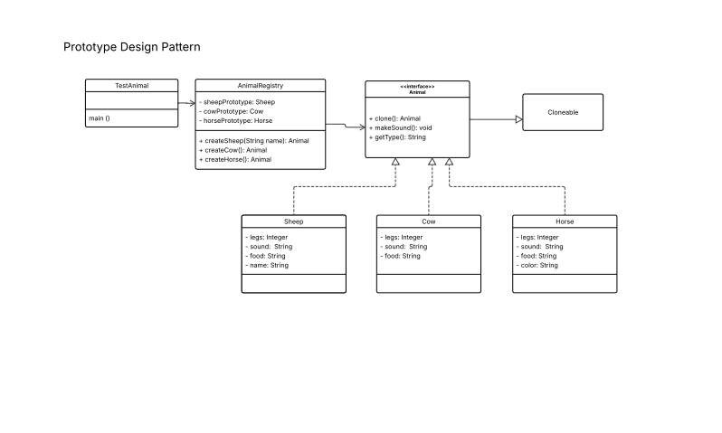

# Laboratory Seatwork 6

## Problem Description

The Prototype design pattern solves the problem of creating new objects by copying an existing object (the prototype) rather than creating them from scratch. This is particularly useful when:

- Object creation is expensive or complex
- Multiple similar objects need to be created
- The exact type of object to create is determined at runtime
- Objects need to be created independently with their own state

In this implementation, we use the Prototype pattern to manage different types of animals (Sheep, Cow, Horse) by maintaining prototype instances in an `AnimalRegistry`. When new animals are needed, they are created by cloning the prototypes, allowing each clone to be modified independently while preserving the original prototype state.

## Class Description

### **Animal (Interface)**
- **Purpose**: Defines the contract for all animal prototypes
- **Methods**:
  - `Animal clone()` - Creates a deep copy of the animal
  - `void makeSound()` - Animals make their respective sounds
  - `String getType()` - Returns the type of animal (Sheep, Cow, or Horse)
- **Extends**: `Cloneable` interface to support object cloning

### **Sheep (Class)**
- **Purpose**: Concrete prototype representing a sheep animal
- **Attributes**:
  - `legs: int` - Number of legs (default: 4)
  - `sound: String` - Sound the sheep makes (default: "Baa")
  - `food: String` - Food the sheep eats (default: "Grass")
  - `name: String` - Name of the sheep (default: "Generic Sheep")
- **Key Methods**:
  - `Animal clone()` - Creates a new Sheep instance with copied attributes
  - `String getType()` - Returns "Sheep"
  - Getters and setters for all attributes

### **Cow (Class)**
- **Purpose**: Concrete prototype representing a cow animal
- **Attributes**:
  - `legs: int` - Number of legs (default: 4)
  - `sound: String` - Sound the cow makes (default: "Moo")
  - `food: String` - Food the cow eats (default: "Grass")
  - `name: String` - Name of the cow
- **Key Methods**:
  - `Animal clone()` - Creates a new Cow instance with copied attributes
  - `String getType()` - Returns "Cow"
  - Getters and setters for all attributes

### **Horse (Class)**
- **Purpose**: Concrete prototype representing a horse animal
- **Attributes**:
  - `legs: int` - Number of legs (default: 4)
  - `sound: String` - Sound the horse makes (default: "Neigh")
  - `food: String` - Food the horse eats (default: "Hay")
  - `color: String` - Color of the horse (default: "Brown")
  - `name: String` - Name of the horse (default: "Blacky")
- **Key Methods**:
  - `Animal clone()` - Creates a new Horse instance with copied attributes
  - `String getType()` - Returns "Horse"
  - Getters and setters for all attributes

### **AnimalRegistry (Class)**
- **Purpose**: Registry and factory that manages animal prototypes and creates clones
- **Attributes**:
  - `sheepPrototype: Sheep` - Prototype instance for sheep
  - `cowPrototype: Cow` - Prototype instance for cow
  - `horsePrototype: Horse` - Prototype instance for horse
- **Key Methods**:
  - `Animal createSheep()` - Creates and returns a cloned Sheep
  - `Animal createCow()` - Creates and returns a cloned Cow
  - `Animal createHorse()` - Creates and returns a cloned Horse
- **Constructor**: Initializes all three prototypes with default values

### **TestAnimal (Class)**
- **Purpose**: Demonstrates the Prototype pattern in action
- **Functionality**:
  - Creates instances of animals through the AnimalRegistry
  - Modifies cloned animals independently
  - Shows that clones are separate objects
  - Displays information about each created animal

## Class Diagram

